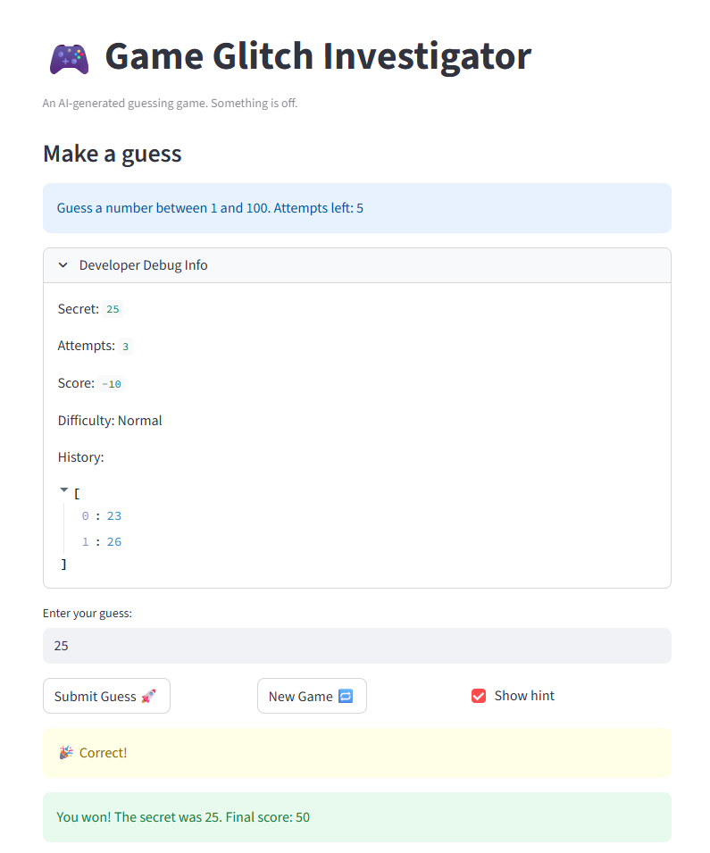
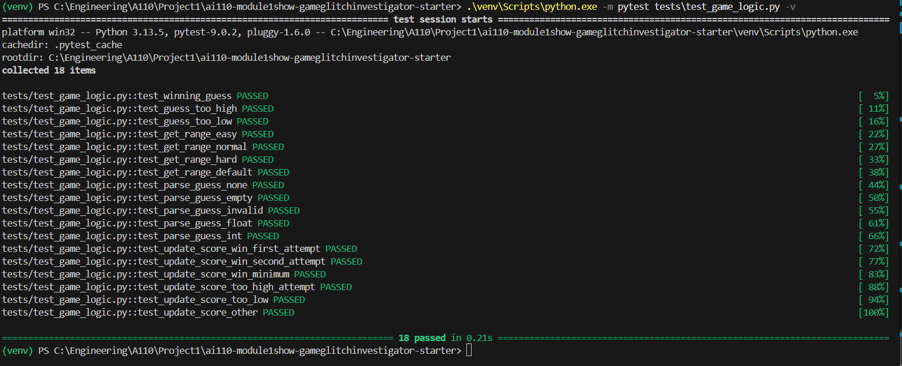

# 🎮 Game Glitch Investigator: The Impossible Guesser

## 🚨 The Situation

You asked an AI to build a simple "Number Guessing Game" using Streamlit.
It wrote the code, ran away, and now the game is unplayable. 

- You can't win.
- The hints lie to you.
- The secret number seems to have commitment issues.

## 🛠️ Setup

1. Install dependencies: `pip install -r requirements.txt`
2. Run the broken app: `python -m streamlit run app.py`

## 🕵️‍♂️ Your Mission

1. **Play the game.** Open the "Developer Debug Info" tab in the app to see the secret number. Try to win.
2. **Find the State Bug.** Why does the secret number change every time you click "Submit"? Ask ChatGPT: *"How do I keep a variable from resetting in Streamlit when I click a button?"*
3. **Fix the Logic.** The hints ("Higher/Lower") are wrong. Fix them.
4. **Refactor & Test.** - Move the logic into `logic_utils.py`.
   - Run `pytest` in your terminal.
   - Keep fixing until all tests pass!

## 📝 Document Your Experience

## Purpose of the Game: 
The game is a streamlit based number guessing game where players select a difficulty level (easy, medium, hard) to guess a number within a range. The game also provides hints ("Too High" or "Too Low"), tracks attempts and returns a score. 

Bugs and Resolution:
Bug 1: The secret number reset randomly on every "Submit" click due to missing session state, making it impossible to win.
Resolution 1: The secret number issue was resolved by initializing the secret number once per game.

Bug 2: Hints were inverted: guessing too high prompted "Go HIGHER!" instead of "Go LOWER!".
Resolution 2: The hint issue was resolved by correcting the messages for guesses.

Bug 3: Difficulty ranges were incorrect: Hard mode had a smaller range (1-50) than Normal (1-100).
Resolution 3: The difficulty ranges were corrected by channging the ranges for normal and hard mode. 

Bug 4: Scoring had a glitch: "Too High" guesses rewarded points on even attempts but penalized on odd ones, inconsistently.
Resolution 4: Removed incongruent scoring method. 

Bug 5: Functions were not refactored, and tests were failing because logic was still in app.py.
Resolution 5: Refactored all game logic functions (get_range_for_difficulty, parse_guess, check_guess, update_score) from app.py to logic_utils.py. Added comprehensive tests in test_game_logic.py

## 📸 Demo

## 🚀 Stretch Features

- [ ] [If you choose to complete Challenge 4, insert a screenshot of your Enhanced Game UI here]
